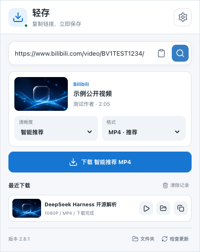
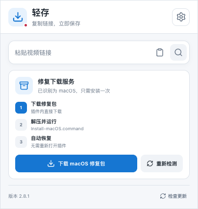
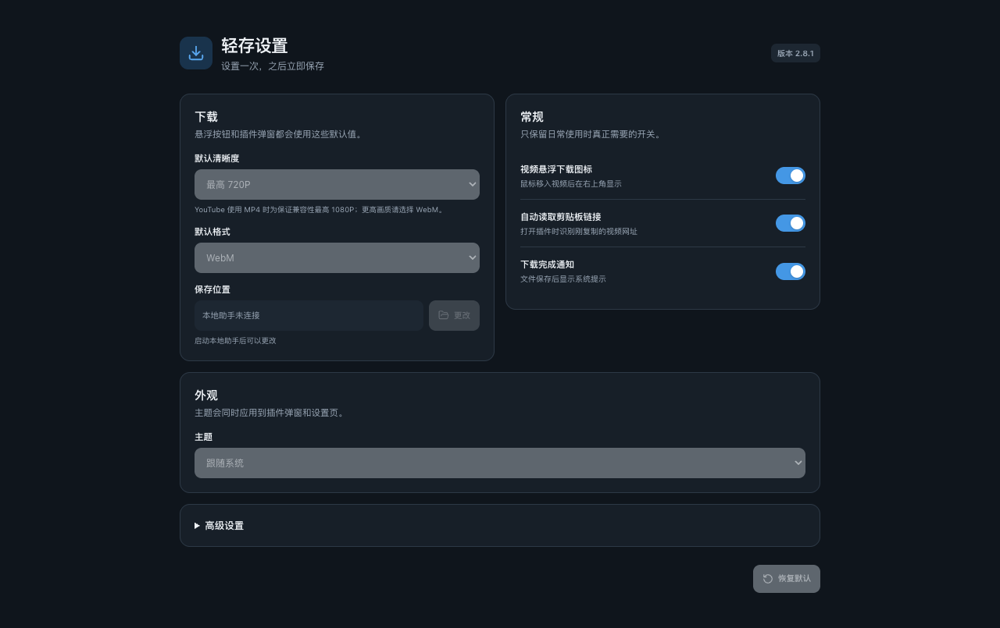

# 轻存

**复制链接或悬停视频，一键识别并保存到本地**

[下载最新版本](https://github.com/wei5590096-stack/video-porter-releases/releases/latest) · [提交问题](https://github.com/wei5590096-stack/video-porter-releases/issues) · [查看更新记录](CHANGELOG.md)

## 产品介绍

轻存是一款面向 Microsoft Edge 的本地在线视频下载工具。复制视频链接，或将鼠标悬停在网页视频上，即可识别并保存；需要时只需选择清晰度与格式，其余步骤由程序自动完成。

产品坚持简单原则：**复制或悬停 → 确认画质 → 保存到本地**。解析、文件命名、音视频合并、进度提示和更新校验由程序自动完成。

> 本仓库是轻存的官方公开发行渠道，用于提供安装包、版本说明、安全更新文件和用户支持，不包含产品源代码。

## 产品预览

<table>
  <tr>
    <td align="center" width="50%">
       
      <strong>复制链接，一步保存</strong> 
      自动识别视频信息，只保留画质、格式和下载三个必要操作
    </td>
    <td align="center" width="50%">
       
      <strong>问题就地修复</strong> 
      自动识别操作系统，在插件内下载对应修复包，不跳转临时链接
    </td>
  </tr>
</table>

   
  <strong>简洁设置 · 自动跟随系统深浅主题</strong>

## 简单，但不简陋

- **少一步操作**：复制链接后打开扩展即可自动识别，也可以在视频上直接使用悬浮下载图标。
- **只展示必要选项**：默认使用智能推荐画质与 MP4，需要时再调整清晰度和格式。
- **状态始终清楚**：解析、下载、合并、完成和失败均提供中文反馈，不再只显示模糊错误。
- **文件留在本机**：解析、下载、合并和文件管理由本地助手完成，不建立云端视频库。
- **更新无需重装**：已安装用户点击“检查更新”，通过签名验证后即可升级到最新稳定版。

## 下载与首次安装

请选择自己的操作系统下载首次安装包：

| 系统 | 下载 | 安装入口 |
| --- | --- | --- |
| macOS | **[下载 macOS 安装包](https://github.com/wei5590096-stack/video-porter-releases/releases/latest/download/video-downloader-macos.zip)** | 解压后右键打开 `Install-macOS.command` |
| Windows 10/11 | **[下载 Windows 安装包](https://github.com/wei5590096-stack/video-porter-releases/releases/latest/download/video-downloader-windows.zip)** | 解压后双击 `Install-Windows.cmd` |

安装程序会启动本地下载助手，并自动打开 Edge 扩展管理页和需要选择的 `extension` 文件夹。然后：

1. 在 Edge 扩展页面打开右上角“开发人员模式”。
2. 点击“加载解压缩的扩展”。
3. 选择安装程序打开的 `extension` 文件夹。

首次安装完成后，后续升级只需在扩展底部点击“检查更新”。

> **请始终加载安装程序打开的固定 `extension` 文件夹。** 不要选择安装包中的 `payload`、`companion` 或 `scripts`。这样扩展和本地下载服务才能在后续更新时保持同一个版本。

## 核心功能

| 功能 | 说明 |
| --- | --- |
| 智能链接识别 | 自动识别平台、标题、作者、时长、缩略图和可用画质 |
| 视频悬浮下载 | 鼠标停留在网页视频区域时显示简洁下载图标 |
| 画质与格式选择 | 提供智能推荐和常用分辨率，支持 MP4 与可用格式 |
| 多平台适配 | 使用统一操作方式处理常见公开媒体平台和 HTML5 视频 |
| 中文文件名 | 自动清理系统不允许的字符，兼容 macOS 与 Windows |
| 下载状态反馈 | 显示解析、下载、合并、完成和失败状态，并提供明确原因 |
| 下载完成操作 | 支持打开文件、打开所在文件夹以及复制文件路径 |
| 安全在线更新 | 点击“检查更新”即可下载并安装签名版本，无需重复安装 |
| 本地优先 | 解析与文件处理由本机助手完成，下载内容直接保存到用户电脑 |

## 支持平台

- YouTube
- Bilibili
- X
- 抖音
- TikTok
- Vimeo
- Instagram
- 普通网页 HTML5 视频和公开媒体直链

平台接口和访问政策可能随时变化。如果视频需要登录、会员资格、付费授权、地区权限或其他访问条件，工具会显示原因，不会尝试绕过限制。

## 使用方式

### 下载视频

1. 复制公开视频网页链接。
2. 打开视频下载助手，链接会自动填入，也可以手动粘贴。
3. 等待程序识别视频并选择清晰度、格式。
4. 点击“下载”，完成后可直接打开文件或所在文件夹。

在支持的网页中，也可以把鼠标停留在视频区域，点击右上角出现的下载按钮。

### 更新软件

已安装用户打开扩展后，点击底部的“检查更新”。发现新版本时点击“更新”，程序会自动完成：

1. 从官方 GitHub Releases 下载版本文件。
2. 验证 Ed25519 数字签名和 SHA-256 文件摘要。
3. 备份当前可用版本。
4. 安装并重新启动本地助手。
5. 更新异常时保留或恢复旧版本。

当前版本：[查看最新 Release](https://github.com/wei5590096-stack/video-porter-releases/releases/latest)

## 首次安装说明

首次安装包同时包含 Edge 扩展安装资源、本地下载助手和系统安装入口。请完整解压 ZIP 后运行安装入口，不要在压缩包预览窗口中直接运行文件，也不要手动加载 `payload` 中的文件。

`latest.json` 和 `*.bundle.json` 是已安装程序使用的安全更新文件，**不是供用户手动打开的安装包**。普通用户只需下载文件名中包含 `macos` 或 `windows` 的 ZIP。

## 系统兼容性

| 项目 | 要求 |
| --- | --- |
| 浏览器 | Microsoft Edge 110 或更高版本 |
| macOS | 支持 Apple Silicon 与常见 Intel 环境；需要本地助手运行权限 |
| Windows | Windows 10/11 64 位；需要允许本地助手运行 |
| 网络 | 需要访问目标视频平台和 GitHub 更新文件 |
| 保存空间 | 取决于所选视频清晰度和时长 |

## 安全与隐私

- 本地助手只监听 `127.0.0.1`，不对局域网或公网开放服务。
- 更新包必须通过内置公钥的数字签名验证，校验失败不会安装。
- 安装更新前保留旧版本，更新失败不会破坏当前可用版本。
- 不会在扩展中内置 GitHub Token、发布私钥或其他开发者凭据。
- 仅在用户明确授权且平台确有需要时读取本机浏览器登录状态；不会上传浏览器 Cookie。
- 不破解 DRM，不绕过付费墙、登录限制、地区限制或平台访问控制。

安全问题请参阅 [安全策略](SECURITY.md)。

## 常见问题

<strong>为什么有些视频无法下载？</strong>

视频可能已删除、设为私密、需要登录或会员权限、受地区限制、使用 DRM，或者平台刚刚调整了接口。工具会尽量显示具体原因，不会绕过访问限制。

<strong>为什么获取清晰度需要一些时间？</strong>

部分平台需要分别获取视频信息和可用媒体流。第一次解析通常较慢，同一链接在缓存有效期内再次打开会更快。

<strong>删除下载记录会删除视频文件吗？</strong>

不会。清除“最近下载”只移除界面记录，不会删除已经保存到磁盘的视频。

<strong>为什么 GitHub Release 里只有 JSON 文件？</strong>

它们是已安装程序的一键更新资产。普通用户不需要手动下载或打开；程序会自动下载、验签并安装。

## 问题反馈

提交问题前请确认正在使用最新版本，并尽量提供：

- 视频下载助手版本号
- 操作系统和 Edge 版本
- 目标平台与公开示例链接
- 完整错误提示
- 能够复现问题的操作步骤

请勿在 Issue 中提交 Cookie、账号密码、访问令牌、本机私有路径或其他敏感信息。

## 合规使用

视频下载助手只用于用户有权访问和保存的公开或已获授权内容。用户应遵守所在地区法律、内容版权要求以及目标平台的服务条款。用户对下载和使用内容的合法性承担责任。

---

**轻存 · 让公开媒体保存更简单**

